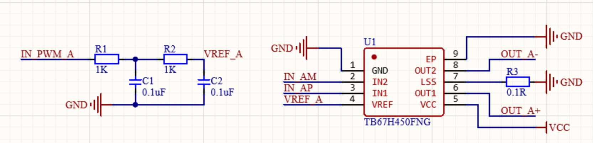
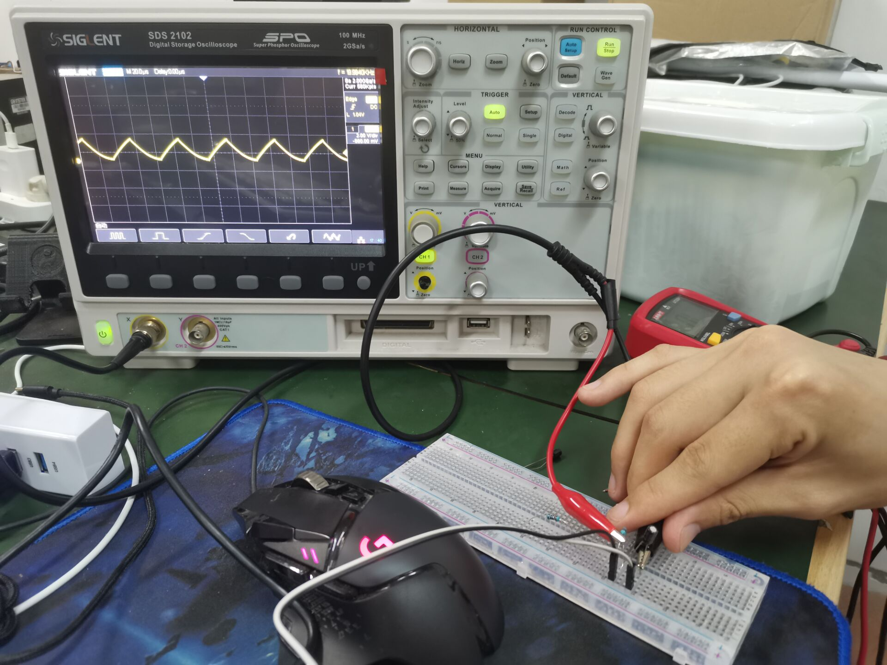

# 步进电机闭环控制

无刷电机3相三线。

步进电机就是2相四线

步进电机是无刷直流电机的子集。

## 步进电机使用foc控制算法好处

不会丢步：抗干扰能力强

更节能：自适应调节电机电压，使得定位误差最小化

## 硬件部分

这个硬件研究的是稚晖君开源的机械臂中的步进电机的闭环控制

### 位置传感器

#### 磁性编码器：MT6816

利用精确的磁场测量来估计位置的传感器。

支持SPI, I2C, PWM以及Analog （模拟输出）

因为是磁性编码器所以在装上步进电机的时候需要在后面放置一个磁铁，对准编码器。

芯片**输出**相应编码的**角度信号**，信号延时低至2us以内，同时用户还可以通过高速SPI接口读取芯片内部计算的**角度数据**。

#### 编码器

一般编码器电机后面的编码器就是霍尔编码器，一般平衡车项目就是用这种。

有AB两项输出，不仅可以测速还可以辨别方向。

一般接单片机的编码器模式的定时器，通过脉冲数来测速度。

#### 霍尔传感器

传感器通过读取转子上的磁铁位置来估计转子位置。

### 驱动器

直流电机的转速和电压成正比，想改变转速需要改变驱动的pwm占空比。相当于调压

pwm频率一般选择20k

#### TB67450FNG

通过组合IN1和IN2来控制电机的正转/反转/停止/**休息**.

通过 Vref 的电压值和连接到 RS 引脚的电阻器的电阻值来控制流过电机的电流。

Vref 引脚：Motor output **current** setting pin。设置电流！！！

RS引脚：Motor output current sense pin。检测电流！

电流计算公式：

.png>)

这边vref用单片机的pwm来控制占空比控制电压从而来控制电流。

.png>)

斩波还不是很了解。

pwm波进来经过电阻电容之前一直很好奇是什么波形，今天想到就用洞洞板测试了一下。

上面这个图是经过两阶滤波

下面这个是一阶滤波：

## 代码部分

